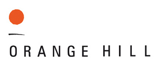
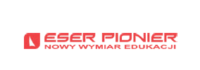
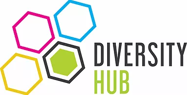

# PROGRAM ROZWOJOWY DLA MŚP

Firmy sektora MŚP nie są gotowe na nadchodzące zmiany na rynku pracy wynikające z demografii i zmiany pokoleniowej. Program PUAP 50+ dotyka wyzwań międzypokoleniowych zespołów, transferu wiedzy, aktywności pracowników 50+ i wspierania i rozwoju pracowników wchodzących na rynek pracy. Dzięki Programowi, rozwiązania dostępne i wykorzystywane przez duże międzynarodowe korporacje są w zasięgu firm z sektora MŚP.

## Szczegółowy plan działań

Program rozpoczął się w grudniu 2017r. i jego główna część trwała do końca 2018r. Zadania realizowane w ramach projektu w znakomitej większości były dostosowane do specyfiki i harmonogramu działania firm testujących biorących udział w Programie.

### Program PUAP zakładał następujące etapy działania:

1. **ETAP PIERWSZY:** Opracowanie rozwiązań adekwatnych do potrzeb firmy - konsultacje proponowanych przez nas rozwiązań.
- #### Konsultowaliśmy:
  - *narzędzie online do audytu* obszaru zarządzania wiekiem,
  - zestaw wzorów pism, gotowych rozwiązań - tzw. *narzędziownik*,
  - *program szkoleń* i związaną z nim analizę potrzeb szkoleniowych,
  - *przewodnik rozwojowy* dla pracowników 50+, wspierający ich dalszy rozwój zawodowy.

1. **ETAP DRUGI:** Testowanie rozwiązań. Szkolenia i realizacja projektów wdrożeniowych.
- Dzięki cyklowi szkoleń (6 dni szkoleniowych), uczestnicy Programu podnieśli swoje kompetencje i wiedzę o tym jak pracować z międzypokoleniowym zespołami, w tym z pracownikami 50+. Poruszane były takie tematy jak:
  - problematyka zdrowia,
  - ergonomia pracy,
  - bariery utrudniające utrzymanie aktywności zawodowej po 50 roku życia,
  - wykorzystanie potencjału, wiedzy i doświadczenia pracowników 50+,
  - wykorzystanie potencjału osób z młodszych pokoleń,
  - zarządzanie wiekiem.
- Uczestnicy Programu przeprowadzili w swoich organizacjach *diagnozę w obszarze zarządzania zespołami międzypokoleniowymi*. Każda firma otrzymała wsparcie eksperta w postaci 24 godzin doradztwa naszych ekspertów.
- Uczestnicy projektu otrzymali materiały wspierające ich pracę: tzw. Narzędziownik (wzory dokumentów, pism, procedur, prezentacji, materiały rozwojowe, gotowe rozwiązania itp. w formie e-booka), a także dostęp do 16 krótkich filmów microlearningowych.
- W drugim półroczu 2018 r. organizacje realizowały indywidualne projekty wdrożeniowe wynikające z wcześniejszej diagnozy przy wsparciu naszych ekspertów (48h).

1. **ETAP TRZECI:** Informacja zwrotna i opracowanie ostatecznych wersji narzędzi.
- Na tym etapie uczestnicy Programu dzielili się z nami swoimi wnioskami.

## Dla kogo jest Program PUAP?
Program jest najbardziej przydatny dla firm, które:

- Są *MŚP*: mikro, małymi lub średnimi firmami,
- zatrudniają osoby *50+*,
- są zainteresowani innowacyjnymi rozwiązaniami z obszaru *zarządzania wiekiem i zespołami międzypokoleniowym*.
- Chcą rozwijać swoich pracowników w tym obszarze zarządzania wiekiem.
- Chcą wspierać i motywować swoich doświadczonych pracowników *do aktywności i rozwoju zawodowego*.

### Co jeszcze powinieneś wiedzieć o Programie PUAP?

Program został zrealizowany w ramach międzynarodowego projektu innowacyjnego, współfinansowanego ze środków Unii Europejskiej w ramach *Europejskiego Funduszu Społecznego.*

Program jest wspólnym przedsięwzięciem kilku organizacji – liderów w branży edukacji, szkoleń, studiów podyplomowych dla biznesu, konsultingu w obszarze rozwoju i zarządzania. [Poznaj nas.]({{'/team' | relative_url}})

#### Cele projektu
- Wdrożenie nowych rozwiązań, w szczególności z zakresu *aktywizacji zawodowej*, kształcenia przez całe życie i tworzenia oraz realizacji polityk publicznych, dzięki współpracy z partnerami zagranicznymi.
- Wsparcie właścicieli, zarządów i pracowników działów HR sektora MŚP w zakresie wzmacniania aktywności zawodowej pracowników w grupie 50+ przez wypracowanie i pilotażowe wdrożenie w organizacjach objętych projektem opracowanego, przy udziale partnera zagranicznego, kompleksowego Programu PUAP 50+.
- Projekt przyczyni się do wdrożenia w sektorze MŚP kompleksowych rozwiązań z zakresu zarządzania wiekiem i metodyki pracy rozwojowej z osobami 50+, które są dostosowane do sektora MŚP i uwzględniają jego specyfikę i środowisko.
- Zastosowanie i wdrożenie narzędzi wypracowanych w projekcie pozwoli na diagnozę sytuacji firm w zakresie zarządzania wiekiem, projekcję modelu symulacyjnego „rozwoju demograficznego” ich pracowników, co będzie *punktem wyjścia do opracowania strategii działań, analizy przyszłych kosztów oraz zobowiązań związanych ze starzejącym się społeczeństwem*.
- Uczestnicy podniosą kompetencje i wiedzę o tym jak pracować z osobami 50+ i wspierać ich w aktywności zawodowej. Zdobędą też praktyczną wiedzę, jak je stosować, także po zakończeniu projektu. Zdobędą również wiedzę na temat odmiennych potrzeb pracujących kobiet i mężczyzn w wieku 50+ w odniesieniu do problematyki zdrowia oraz ergonomii pracy, zachorowań i umieralności w tej grupie wiekowej oraz barier utrudniających kobietom i mężczyznom utrzymanie aktywności zawodowej po 50 roku życia.

## Partnerzy projektu

##### **Orange Hill Sp. z o.o.**
*Lider projektu*

[www.orangehill.pl](http://www.orangehill.pl)

##### **Wyższa Szkoła Europejska im. Ks. Józefa Tischnera w Krakowie**
*Partner Projektu*

[www.wse.krakow.pl](http://www.wse.krakow.pl/pl/)

##### **Europejskie Stowarzyszenie Edukacji i Rozwoju PIONIER**
*Partner Projektu*

[eserpionier.eu](http://eserpionier.eu/)

##### **Diversity Hub**
*Partner Wspierający*

[www.diversityhub.pl](http://www.diversityhub.pl/)
